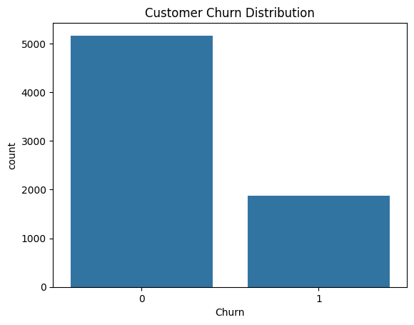
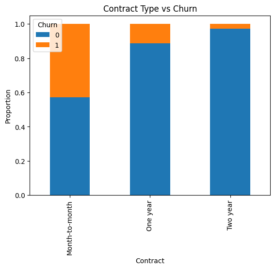
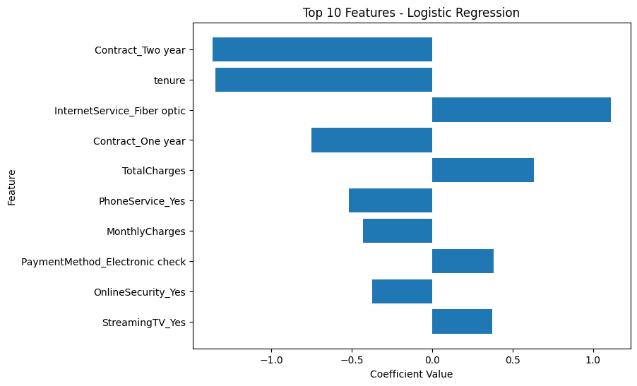
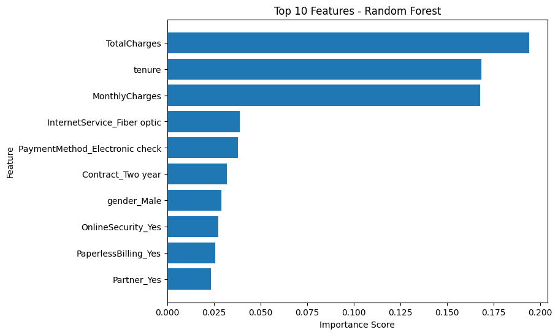

# Telco Customer Churn Prediction
## Project Overview

Customer churn, the loss of customers to competitors, is one of the biggest challenges in the telecommunications industry. Acquiring new customers is often five times more expensive than retaining existing ones.

This project aims to analyze historical customer data and build a predictive model that identifies customers most likely to churn. By recognizing these at-risk customers early, the company can take proactive actions such as offering promotions, improving service quality, or providing personalized engagement ultimately reducing churn and increasing customer lifetime value.

## Problem Statement

The objective of this project is to predict customer churn based on demographics, account information, and service usage patterns.

Specifically, we aim to:

- Understand the factors contributing to customer churn through exploratory  data analysis (EDA).

- Build and compare machine learning models to classify whether a customer is likely to churn.

- Evaluate the models using key performance metrics.

- Provide actionable business insights to guide retention strategies.

## Business Value

Predicting churn enables the company to:

- Reduce revenue loss by identifying customers at risk of leaving.

- Improve retention rates through targeted campaigns and service improvements.

- Optimize marketing spend by focusing on customers with the highest churn probability.

For example, if each retained customer represents an average revenue of $1000 per year, reducing churn by even 5% can lead to significant savings.

## Dataset Information

Dataset name: WA_Fn-UseC_-Telco-Customer-Churn.csv

Source: Kaggle – Telco Customer Churn Dataset

Rows: 7,043

Columns: 21

## Tools and Technologies

- Python Libraries: pandas, numpy, matplotlib, seaborn, scikit-learn

- Data Handling: Python (for preprocessing and analysis)

- Visualization: Matplotlib, Seaborn

- Modeling: Logistic Regression, Random Forest

- Evaluation: Classification metrics and ROC curves

- IDE: Jupyter Notebook

## Project Workflow
1. Data Loading and Inspection

The dataset used in this analysis is the Telco Customer Churn Dataset from Kaggle. It contains customer-level information such as tenure, payment method, contract type, and churn status.

- Total Records: 7,043

- Features: 21

- Target Variable: Churn (Yes / No)

2. Data Cleaning and Preprocessing

- Handled missing values in TotalCharges by imputing with median values.

- Converted categorical variables into numerical form using Label Encoding and One-Hot Encoding.

- Normalized numerical features using StandardScaler to ensure model stability.

3. Exploratory Data Analysis (EDA)

Exploratory analysis was conducted to uncover trends and relationships in the data.

Key insights:

- Tenure: Customers with shorter tenures have a significantly higher churn rate.

- Contract Type: Month-to-month customers are more likely to churn compared to those on annual or two-year contracts.

- Payment Method: Customers using electronic checks show higher churn tendencies.

- Monthly Charges: Higher monthly charges correlate with higher churn probability.

## EDA Visualizations:
- Churn Distribution: Bar chart showing class imbalance between churned and retained customers.

- Contract Type vs Churn: Stacked bar showing churn rates by contract duration.

## Model Development
Two classification models were developed and compared:

1. Logistic Regression (LR)

- Chosen for interpretability and as a strong baseline model.

- Provides insights into how individual features affect churn likelihood through coefficient values.

2. Random Forest Classifier (RF)

- Chosen for its robustness and ability to capture complex, non-linear relationships.

- Provides feature importance rankings for interpretability.

## Model Evaluation
The dataset was split into 80% training and 20% testing subsets.
Model performance was evaluated using Accuracy, Precision, Recall, F1-score, and ROC-AUC to ensure both predictive accuracy and class balance handling.

| Metric        | Logistic Regression | Random Forest |
| :------------ | :-----------------: | :-----------: |
| **Accuracy**  |        0.8045       |     0.7875    |
| **Precision** |        0.6495       |     0.6221    |
| **Recall**    |        0.5749       |     0.5107    |
| **F1-Score**  |        0.6099       |     0.5609    |
| **ROC-AUC**   |        0.8360       |     0.8178    |

Findings:

- Logistic Regression performed slightly better than Random Forest across most metrics, particularly Recall and F1-score.

- Both models achieved strong AUC scores (>0.81), indicating a good ability to distinguish between churned and non-churned customers.

- Logistic Regression’s interpretability makes it a strong choice for business decision-making, while Random Forest offers robustness and non-linearity handling.

## Model Optimization
Although the baseline models achieved strong results, their recall and precision values indicated that some churners were still being missed, and a moderate number of loyal customers were being incorrectly flagged as churners.

In churn prediction, this trade-off is critical:
- Low recall → missed churners → potential revenue loss.

- Low precision → loyal customers targeted unnecessarily → increased marketing costs.

To address this, model optimization was performed through:

- Class Weight Balancing — to make both models more sensitive to the minority churn class.

- Threshold Optimization — to find the best decision threshold that maximizes the F1-score (balance between precision and recall).

### Optimized Model Results
After optimization, both models improved their ability to capture churners, achieving better recall and balanced F1-scores.

| Metric        | Logistic Regression (Optimized) | Random Forest (Optimized) |
| :------------ | :-----------------------------: | :-----------------------: |
| **Accuracy**  |              0.787              |           0.760           |
| **Precision** |              0.588              |           0.538           |
| **Recall**    |              0.671              |           0.701           |
| **F1-Score**  |              0.627              |           0.609           |
| **ROC-AUC**   |              0.835              |           0.819           |

### Interpretation:

- The optimized models achieved higher recall, improving their ability to detect churners.

- Though accuracy slightly dropped, this trade-off is acceptable in business settings where missing churners is costlier than flagging loyal customers.

- The optimized Logistic Regression model offered the best trade-off between interpretability, recall, and overall performance.

### Business Impact:

- The optimized models now identify a larger proportion of true churners, helping reduce customer loss through targeted retention campaigns.

- Logistic Regression is preferred for deployment due to its simplicity, interpretability, and balanced performance.

- Random Forest can serve as a secondary model for experimental use where higher recall is prioritized.

## Top 10 Most Influential Features
### Logistic Regression (Top 10 Features)
| Feature                        | Coefficient |
| :----------------------------- | ----------: |
| Contract_Two year              |   -1.364197 |
| tenure                         |   -1.348550 |
| InternetService_Fiber optic    |    1.108470 |
| Contract_One year              |   -0.748888 |
| TotalCharges                   |    0.634001 |
| PhoneService_Yes               |   -0.517122 |
| MonthlyCharges                 |   -0.430947 |
| PaymentMethod_Electronic check |    0.380924 |
| OnlineSecurity_Yes             |   -0.373453 |
| StreamingTV_Yes                |    0.371831 |

### Visualization: Top 10 Features (LR)

Interpretation:

- Negative coefficients (−) reduce churn likelihood.
→ Customers with longer tenure or multi-year contracts tend to stay.

- Positive coefficients (+) increase churn likelihood.
→ Customers with fiber optic service, electronic check payments, or streaming TV are more likely to churn.

### Random Forest (Top 10 Features)
| Feature                        | Importance |
| :----------------------------- | ---------: |
| TotalCharges                   |   0.194313 |
| tenure                         |   0.168529 |
| MonthlyCharges                 |   0.167972 |
| InternetService_Fiber optic    |   0.038913 |
| PaymentMethod_Electronic check |   0.037898 |
| Contract_Two year              |   0.031862 |
| gender_Male                    |   0.028939 |
| OnlineSecurity_Yes             |   0.027288 |
| PaperlessBilling_Yes           |   0.025595 |
| Partner_Yes                    |   0.023280 |

### Visualization: Top 10 Features (RF)

Interpretation:

- Tenure, TotalCharges, and MonthlyCharges are the strongest churn predictors.

- Fiber optic and electronic check users show higher churn tendencies.

- Two-year contracts and online security lower churn risk.

## Comparative Insight

Both models highlight contract type, tenure, monthly charges, and payment method as key churn drivers.
While Logistic Regression reveals the direction of each relationship (positive or negative), Random Forest confirms their importance ranking.
Together, they emphasize that:

Customers with short contracts, higher bills, or electronic payments are more prone to churn,
while long-term, loyal customers with secure services are more likely to stay.

## Business Insights and Recommendation
- Contract Type:
Customers on month-to-month contracts are more likely to churn.
→ Encourage long-term contracts through loyalty discounts.

- Monthly Charges:
High-charging customers tend to leave.
→ Consider tiered pricing or loyalty rewards for premium users.

- Tenure:
New customers have a higher risk of churn.
→ Introduce onboarding programs to improve early retention.

- Payment Method:
Electronic check users churn more often.
→ Promote credit card or auto-pay options for convenience.

- Internet Service:
Fiber optic customers churn more frequently.
→ Investigate service quality and satisfaction issues in this segment.

- Model Deployment:
The final model can be integrated into a CRM system to flag high-risk customers for proactive engagement.

## Conclusion

This project demonstrates how machine learning can effectively predict customer churn and support data-driven retention strategies.
While Logistic Regression provided interpretability and strong recall, Random Forest added robust feature insights.

With recall-optimized models, telecom companies can proactively identify customers at risk, reduce churn, and enhance customer lifetime value.

